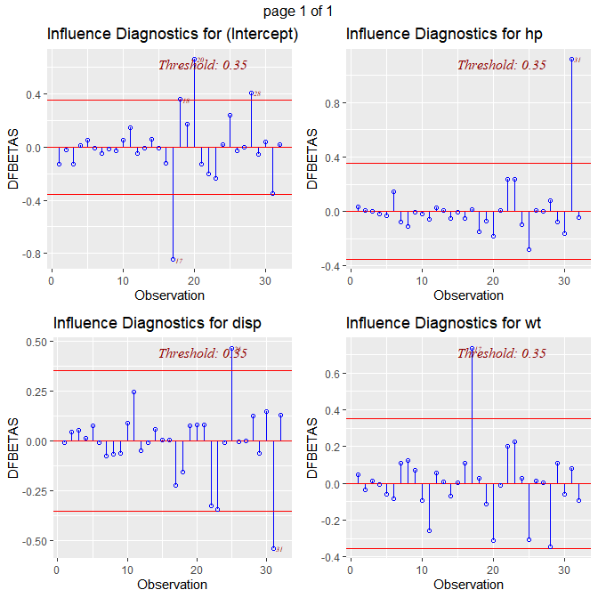

```{r setup, include=FALSE}
knitr::opts_chunk$set(echo = FALSE)
```
## Measures of Influence
<font size="3">Material extrated from: </font> 
<font size="3">[https://cran.r-project.org/web/packages/olsrr/vignettes/influence_measures.html](https://cran.r-project.org/web/packages/olsrr/vignettes/influence_measures.html)</font> 
<font size="3"> Introduction: </font>
 <font size="3">  It is possible for a single observation to have a great influence on the results of a regression analysis.  </font> 
 <font size="3"> It is therefore important to detect influential observations and to take them into consideration when interpreting the results.</font> 
 <font size="3"> Package olsrr offers the following tools to detect influential observations:</font> 

*  <font size="3"> Cook’s D Bar Plot</font> 
*  <font size="3"> Cook’s D Chart</font> 
*  <font size="3"> DFBETAs Panel</font> 
* <font size="3">DFFITs Plot</font> 
* <font size="3">Studentized Residual Plot</font> 
* <font size="3">Standardized Residual Chart</font> 
* <font size="3">Studentized Residuals vs Leverage Plot</font> 
* <font size="3">Deleted Studentized Residual vs Fitted Values Plot</font> 
* <font size="3">Hadi Plot</font> 
* <font size="3"> Potential Residual Plot</font> 


## Cook’s D Bar Plot
<font size="3">Bar Plot of Cook’s distance to detect observations that strongly influence fitted values of the model.</font> 
<font size="3">Cook’s distance was introduced by American statistician R Dennis Cook in 1977. It is used to identify influential data points. </font> 
<font size="3">It depends on both the residual and leverage i.e it takes it account both the x value and y value of the observation.</font>

{width=500px}


## DFBETAs Panel
<font size="3">DFBETA measures the difference in each parameter estimate with and without the influential point. There is a DFBETA for each data point i.e </font>
<font size="3">if there are n observations and k variables, there will be n∗k DFBETAs. In general, large values of DFBETAS indicate observations that are </font>
<font size="3">influential in estimating a given parameter. Belsley, Kuh, and Welsch recommend 2 as a general cutoff value to indicate influential observations </font>
<font size="3">and 2n√n as a size-adjusted cutoff.</font>

{width=300px}

## DFFITS Plot
<font size="3">Proposed by Welsch and Kuh (1977). It is the scaled difference between the ith fitted value obtained from the full data and</font>
<font size="3">the ith fitted value obtained by deleting the ithobservation. DFFIT - difference in fits, is used to identify influential </font>
<font size="3">data points. It quantifies the number of standard deviations that the fitted value changes when the ith data point is omitted.</font>
<font size="3">Steps to compute DFFITs:</font>

* <font size="3"> delete observations one at a time.</font>
* <font size="3"> refit the regression model on remaining observations</font>
* <font size="3"> examine how much all of the fitted values change when the ith observation is deleted.</font>

<font size="3">An observation is deemed influential if the absolute value of its DFFITS value is greater than:</font>
{width=150px}


<font size="3">where n is the number of observations and p is the number of predictors including intercept.</font>


